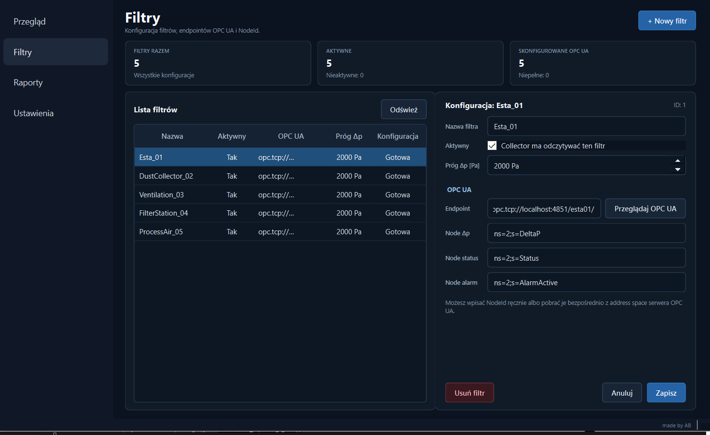
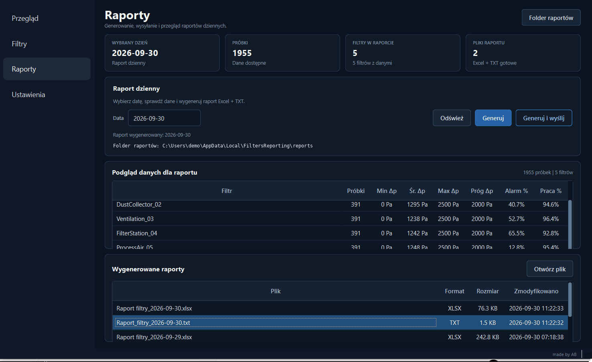
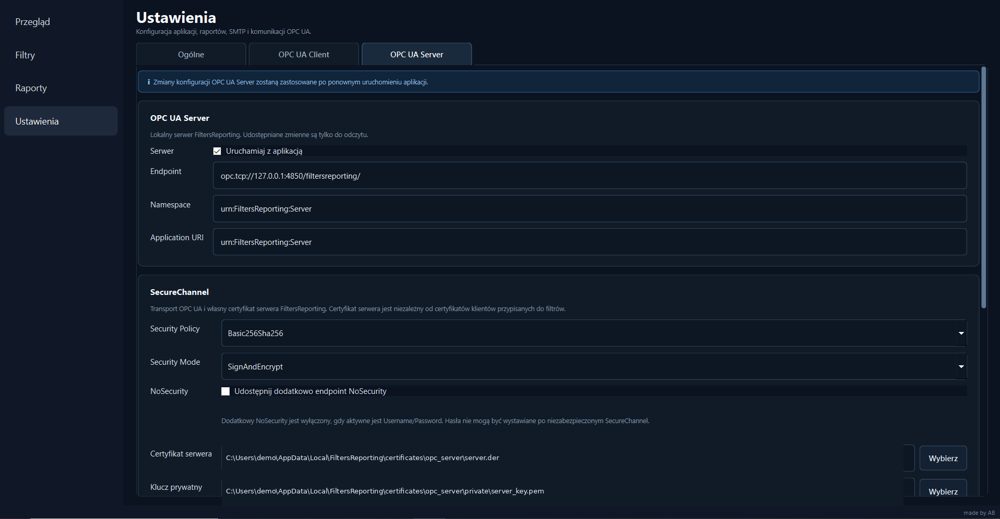

# FiltersReporting v1.0.0 --- Showcase

This document presents the main user-facing and technical areas of
FiltersReporting. The screenshots use simulated OPC UA machines and
anonymised local paths/identifiers.

## 1. Monitoring dashboard


The dashboard is the operational view of the application. It combines
collector state and collection interval, OPC UA connectivity, database
status, filters requiring attention, daily-report actions, recent
runtime events and system-state information.

The screenshot shows five configured filters, five connected OPC UA
machines and two filters currently requiring attention.

## 2. Independent filter configuration



The v1.0 data model is intentionally machine-oriented:

``` text
one filter = one independent OPC UA endpoint
```

For every filter the user can configure the filter name and active
state, Δp threshold, OPC UA endpoint and the `DeltaP`, `Status` and
`AlarmActive` NodeIds. NodeIds can be entered manually or selected
through the OPC UA namespace browser.

## 3. Daily reporting



The Reports view previews data for the selected day before report
generation. The summary includes sample count, minimum/average/maximum
Δp, configured threshold, alarm percentage and operating percentage.

FiltersReporting generates both Excel and TXT output and can send the
report through configured SMTP delivery.

## 4. General settings and automation


General settings cover the SQLite database location, report output
directory, automatic daily-report scheduling and SMTP configuration.

Changing the database location does not migrate an existing SQLite
database automatically. Persistent SMTP credentials are protected with
Windows DPAPI for the current Windows user rather than stored as plain
text in `settings.json`.

## 5. Per-machine OPC UA Client


Every filter has an independent OPC UA Client configuration. Machines
can therefore differ in endpoint, security requirements, certificates
and authentication without introducing one global connection profile.

The client configuration supports:

-   Security Policy: `None`, `Basic256Sha256`, `Aes128Sha256RsaOaep`,
    `Aes256Sha256RsaPss`
-   Security Mode: `None`, `Sign`, `SignAndEncrypt`
-   client certificate and private key
-   trusted certificate directory
-   expected server certificate
-   optional server-certificate validation
-   Anonymous or Username/Password authentication
-   connection/request timeouts
-   reconnect delay


Client certificates can be generated per machine. Stored per-machine
credentials are protected through Windows DPAPI.

## 6. Optional local OPC UA Server



FiltersReporting also contains an optional local OPC UA Server for
exposing selected monitoring information as read-only variables.

The server configuration includes endpoint, namespace, Application URI,
Security Policy, Security Mode, server certificate, private key and an
optional additional NoSecurity endpoint.


The v1.0 runtime server advertises `AnonymousIdentityToken`.
Username/Password fields exist in the configuration UI, but server-side
Username/Password authentication is not presented as an active v1.0
runtime feature.

## 7. Runtime separation

The GUI and collector are separate processes.

``` text
FiltersReporting.exe
        │
        └──> FiltersReportingCollector.exe
                     │
                     ├──> independent OPC UA clients
                     ├──> SQLite
                     └──> rotating collector.log
```

This separation keeps data acquisition independent from the presentation
layer and makes collector lifecycle and diagnostics explicit.

A packaging-specific issue solved in v1.0.0 is that a frozen PyInstaller
GUI cannot use its own `sys.executable` as though it were
`python.exe -m ...`. The installed GUI therefore starts the dedicated
collector executable.

## 8. Validation

The final v1.0.0 release passed:

``` text
359 automated tests
```

The installed build was additionally smoke-tested for GUI startup,
collector lifecycle, 5/5 OPC UA collection, sustained acquisition,
logging, settings persistence, Excel/TXT generation, SMTP delivery and
automatic daily reporting.

------------------------------------------------------------------------

For operating instructions, see [USER_MANUAL.md](USER_MANUAL.md).
