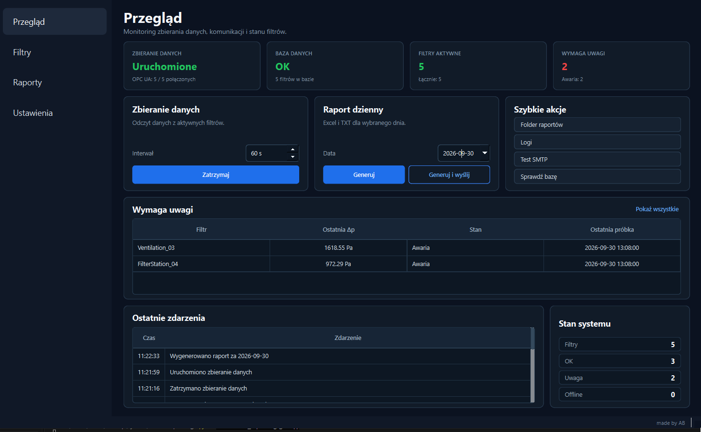
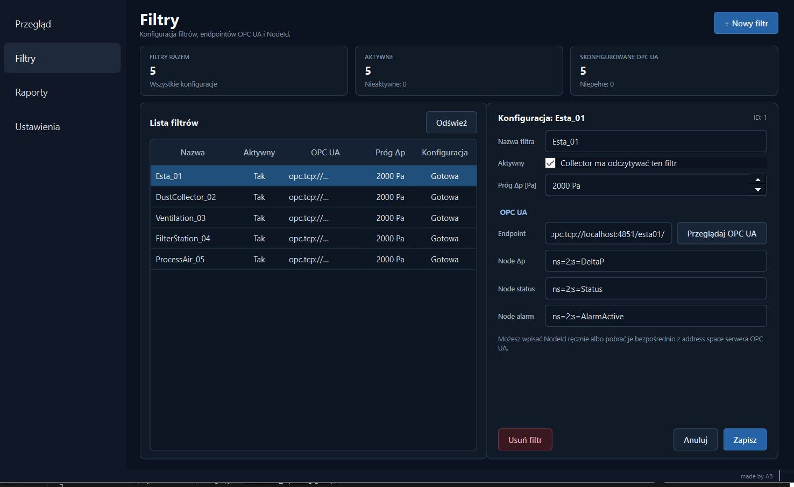
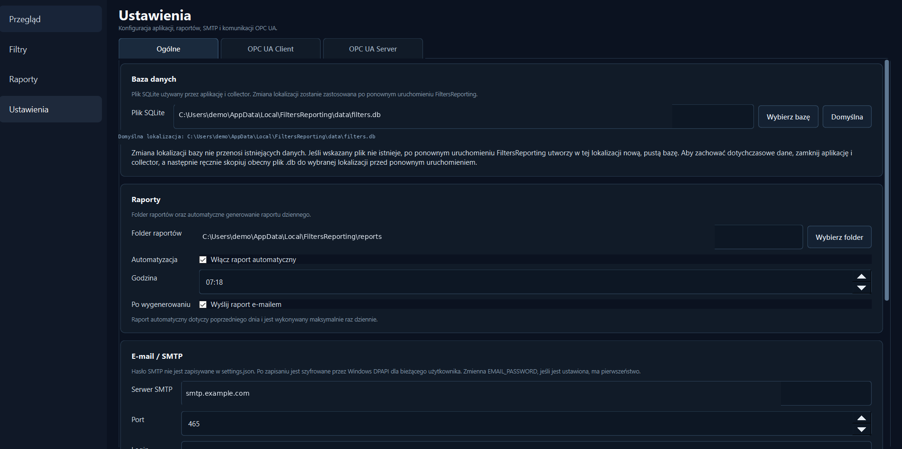
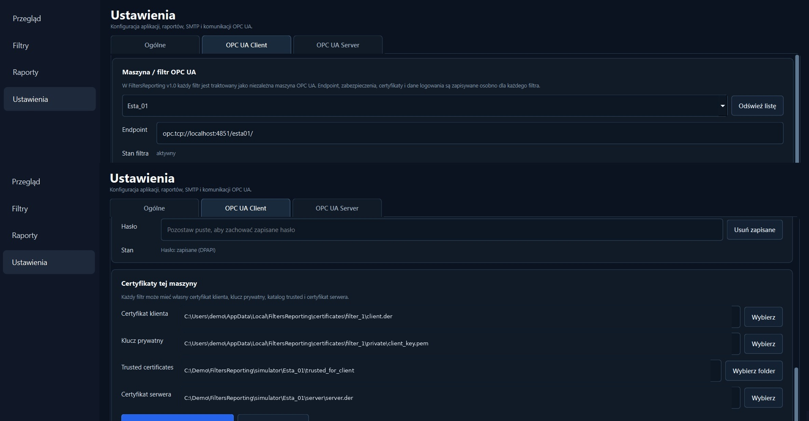
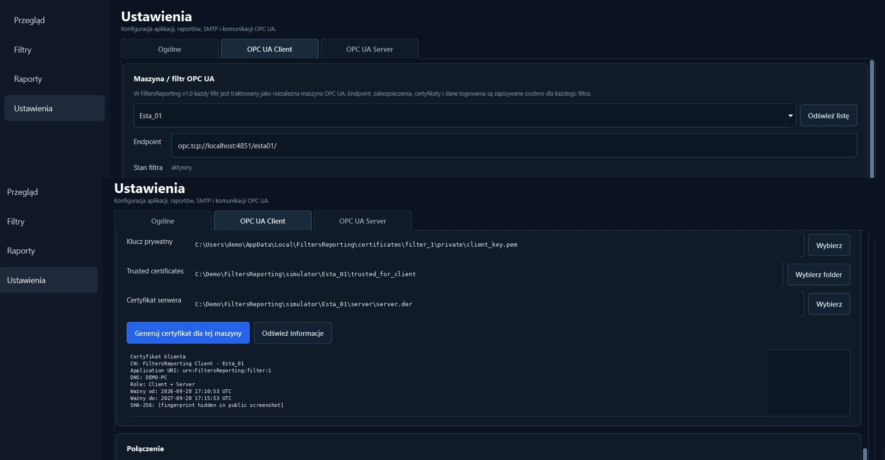
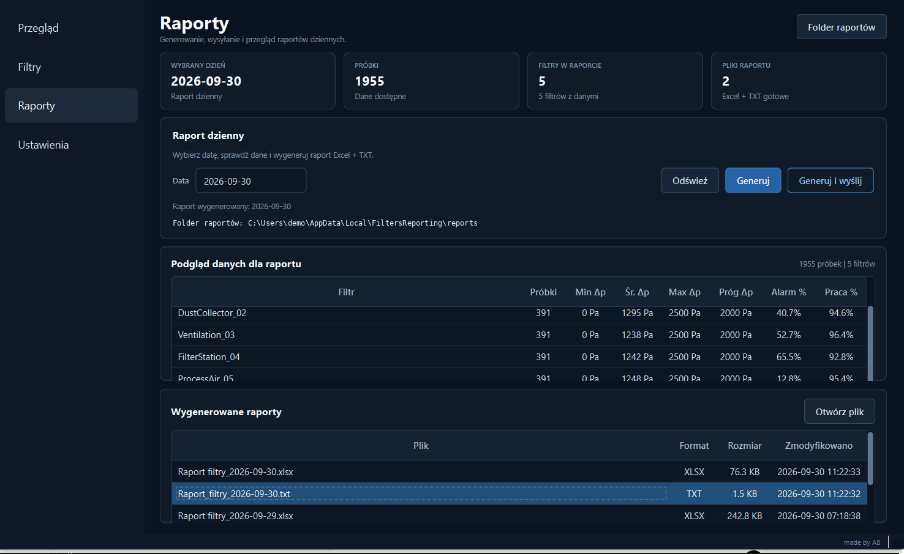
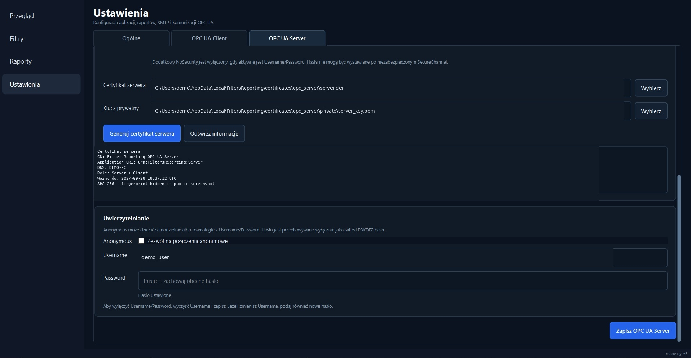

# FiltersReporting v1.0.0 --- User Manual

## 1. Purpose

FiltersReporting is a Windows desktop application for collecting,
monitoring and reporting filtration-system data from independent OPC UA
machines.

The central v1.0 rule is:

``` text
one filter = one independent OPC UA machine
```

Each filter can therefore use its own endpoint, NodeIds, certificates,
security policy, security mode and authentication settings.

## 2. Main navigation

The application contains four main views:

-   **Przegląd** --- monitoring dashboard and collector controls
-   **Filtry** --- filter/machine configuration and NodeIds
-   **Raporty** --- daily report preview, generation and files
-   **Ustawienia** --- database, reports, SMTP, OPC UA Client and OPC UA
    Server configuration



## 3. First configuration

A practical first-start sequence is:

1.  Open **Ustawienia → Ogólne**.
2.  Verify the SQLite database path.
3.  Select the report output directory.
4.  Configure automatic reporting if required.
5.  Configure SMTP if reports will be sent by e-mail.
6.  Create/configure filters in **Filtry**.
7.  Configure the OPC UA Client separately for every filter.
8.  Test connectivity.
9.  Return to **Przegląd** and start data collection.

## 4. Dashboard --- `Przegląd`


The upper cards summarize collector state, database state, active-filter
count and filters currently requiring attention. The collector card also
shows OPC UA connectivity.

Set **Interwał** and use the collector action button. When collection is
running, the button changes to **Zatrzymaj**.

The collector operates as a separate process. In the installed version
the GUI launches:

``` text
FiltersReportingCollector.exe
```

The **Wymaga uwagi** table surfaces filters whose current state requires
operator attention. **Ostatnie zdarzenia** shows recent runtime actions
such as collector start/stop and report generation.

Quick actions provide access to reports, logs, SMTP testing and database
checks.

## 5. Filters --- `Filtry`



Use **+ Nowy filtr** to create a filter and configure:

-   **Nazwa filtra**
-   **Aktywny**
-   **Próg Δp \[Pa\]**
-   **Endpoint**
-   **Node Δp**
-   **Node status**
-   **Node alarm**

Save with **Zapisz**.

The application expects three logical signals:

``` text
DeltaP
Status
AlarmActive
```

The exact NodeIds are machine-specific. Use **Przeglądaj OPC UA** to
browse the server address space and select NodeIds instead of entering
them manually.

## 6. Settings --- `Ustawienia → Ogólne`



### SQLite database

The configured SQLite file is used by both the GUI and collector.

**Important:** changing the database path does **not** migrate existing
data.

To move an existing database:

1.  Stop the collector.
2.  Close FiltersReporting.
3.  Copy the existing database file manually.
4.  Configure/select the new path.
5.  Start FiltersReporting again.

If the configured file does not exist, FiltersReporting can create a new
empty database at that location after restart.

### Reports and automatic reporting

Select the report output directory. Enable **Włącz raport automatyczny**
and select the execution time when scheduling is required.

The automatic report concerns the **previous day** and is executed at
most once per day.

Enable **Wyślij raport e-mailem** if the generated report should also be
sent through SMTP.

### SMTP

Configure SMTP server, port, login, sender, recipients and password. Use
the built-in SMTP test before relying on automatic delivery.

Persistent SMTP credentials are protected using Windows DPAPI for the
current Windows user. The password is not stored as plain text in
`settings.json`. If `EMAIL_PASSWORD` is configured as an environment
variable, it takes precedence over the persisted credential.

## 7. OPC UA Client --- per machine

Open **Ustawienia → OPC UA Client**.



Select the machine/filter at the top. The configuration below applies
only to that machine.

Each filter can have its own endpoint, Application URI, Security Policy,
Security Mode, authentication mode, credentials, timeouts and reconnect
delay.

Supported security policies in v1.0 include:

``` text
None
Basic256Sha256
Aes128Sha256RsaOaep
Aes256Sha256RsaPss
```

Supported security modes:

``` text
None
Sign
SignAndEncrypt
```

### Certificates



Each machine can use its own client certificate, private key,
trusted-certificate directory and expected server certificate.

Use **Generuj certyfikat dla tej maszyny** when a dedicated client
certificate is required.

Client-side authentication supports:

``` text
Anonymous
Username/Password
```

Per-machine stored passwords are protected with Windows DPAPI.

## 8. Reports --- `Raporty`



Select a date to inspect available data. The preview includes sample
count, minimum Δp, average Δp, maximum Δp, configured Δp threshold,
alarm percentage and operating percentage.

Use **Generuj** to create:

``` text
.xlsx
.txt
```

The Excel report contains summary and sample-level data.

Use **Generuj i wyślij** to generate the report and send it using the
configured SMTP settings. The lower table lists generated files and
allows a selected report to be opened.

## 9. Optional local OPC UA Server

Open **Ustawienia → OPC UA Server**.


The local server exposes selected FiltersReporting monitoring data as
read-only OPC UA variables.

Configurable properties include:

-   start with application
-   endpoint
-   namespace
-   Application URI
-   Security Policy
-   Security Mode
-   server certificate
-   private key
-   optional additional NoSecurity endpoint

Server configuration changes are applied after application restart.



The v1.0 runtime OPC UA Server advertises:

``` text
AnonymousIdentityToken
```

Although Username/Password-related fields are visible in the
configuration UI, server-side Username/Password authentication should
not be treated as an active v1.0 runtime capability.

## 10. Logs

Use:

``` text
Przegląd → Logi
```

to open the collector log.

A typical successful collection entry is:

``` text
Cykl 1: zapisano 5/5 próbek. | OPC_OK
```

The frozen GUI and collector explicitly share the same resolved log-file
path.

## 11. Troubleshooting

### One machine is offline

Check that machine's endpoint, network availability, Security
Policy/Mode, certificates, authentication credentials and NodeIds. A
failure on one machine does not stop collection from the remaining
machines.

### Collector does not start

Check the collector log and verify that another collector instance is
not already running. The application includes single-instance
protection.

### No report data

Verify the selected date, that the collector was running, that samples
exist and that the expected SQLite database is selected.

### SMTP delivery fails

Verify SMTP server, port, sender/login, recipients and credential
availability. Use the built-in SMTP test.

### Database appears empty after changing its path

Changing the configured path does not copy the old database. Stop the
GUI and collector and manually copy the original SQLite file if
historical data must be retained.

## 12. v1.0.0 validation

The released build was validated with:

``` text
359 automated tests passed
```

The installed-build smoke test also covered GUI startup, collector
start/stop/restart, 5/5 OPC UA collection, sustained collection,
collector logging, settings persistence, Excel/TXT generation, SMTP
delivery and automatic daily reporting.

## 13. License

FiltersReporting is proprietary software. The public repository is
provided for portfolio and source-review purposes only.

See the repository `LICENSE` file for the applicable terms.
